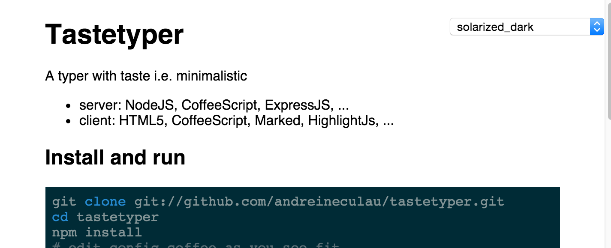

# Tastetyper

A wiki with taste i.e. minimalistic

* server: NodeJS, CoffeeScript, ExpressJS, ...
* client: HTML5, CoffeeScript, Marked, HighlightJs, ...




## Install and run

```sh
git clone git://github.com/andreineculau/tastetyper.git
cd tastetyper
npm install
# edit config.coffee as you see fit
npm start
```

Here's what you can configure out-of-the-box: [config.coffee](config.coffee).

In production, try

* [forever](https://github.com/foreverjs/forever)
* [upstarter](https://github.com/carlos8f/node-upstarter)
* ...


## Tested browsers

* Chrome 44


## License

[Apache 2.0](LICENSE)
